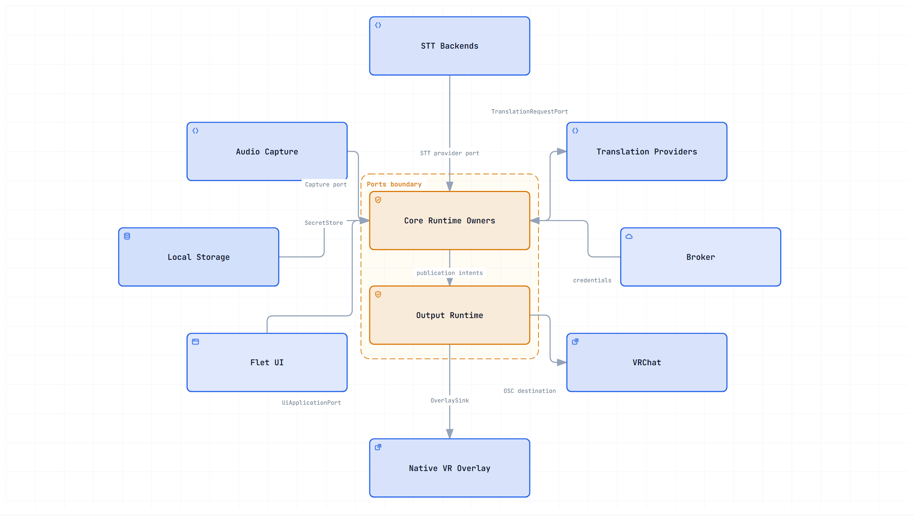

<p align="center">

  

</p>

<h1 align="center">PuriPuly<br>
  <sub>VRChat 실시간 양방향 음성 번역기</sub>
</h1>

<p align="center">

  

  

  

  

</p>

<h2 align="center">

  <a href="README.md">🇺🇸 English</a> ·
  🇰🇷 한국어 ·
  <a href="README.ja.md">🇯🇵 日本語</a> ·
  <a href="README.zh-CN.md">🇨🇳 简体中文</a> ·
  <a href="README.ru.md">🇷🇺 Русский</a>

</h2>

---

## 데모


---

<video src="https://github.com/user-attachments/assets/c667f44d-b91d-42a9-b24a-e6a993b392d3" controls width="100%">

</video>

PuriPuly를 통해 다른 외국인 친구들과 실제로 소통하는 모습을 더 보고 싶다면:

- [데모 1](https://www.youtube.com/watch?v=3p0CamYui0o)
- [데모 2](https://youtu.be/DoX36Y7J_lc?si=YjbeVTS8v3jGQB1w)
- [데모 3](https://www.youtube.com/watch?v=D0npvp68xNY)

---

## Finally, talk like real friends.

위로하고 싶었는데  
"괜찮아?"밖에 못 건넨 적 있잖아요.

전하고 싶은 마음이  
'번역기'로는 안 되는 거 알잖아요.

그래서 만들었어요.

## PuriPuly란?

PuriPuly는 내 목소리와 상대방의 목소리를 실시간으로 번역하는 Windows용 양방향 음성 번역기예요.
LLM을 통한 자연스러운 번역을 추구하고 있어요.
딱딱한 번역을 넘어 진짜 사람 대 사람간의 소통이 가능할 수 있도록요.
VRChat, Discord를 포함하여 여러 환경에서 사용 가능해요.

- **LLM 기반 현지화** — 슬랭, 구어체, 반말/존댓말까지 자연스럽게
- **맥락 기억** — 문맥을 고려한 자연스러운 대화 흐름 유지
- **양방향 음성 번역** — 상대 음성도 같이 번역, VR 자막 오버레이 지원
- **디스코드로 시작** — 복잡한 설정 과정 없이 최적의 옵션으로 사용 가능
- **가장 강력한 로컬 풀스택** — Parakeet에서 Gemma 4까지, 지금 가장 효율적인 모델을 탑재

## 자주 묻는 질문

- **번역 품질은 어느정도인가요?**
→ 사람과 사람이 나눌 수 있는 가장 깊은 대화까지 무리 없이 나눌 수 있어요. 또한 전통적인 상용 번역 서비스들을 큰 차이로 앞서요. 자세한 내용은 아래의 '번역 품질 비교' 항목을 봐주세요.
- **말하고 번역이 되기까지 시간이 얼마나 걸리나요?**
→ 최적의 상황이라면 지연시간은 1초 부근이에요. 상대방의 발화가 끝났을 때가 기준이에요.
- **사용하는데 돈이 드나요?**
→ 네, 하지만 나중에요. 신규 사용자에게는 무료 사용량이 주어져요. 그 이후에도 가격은 매우 저렴해요. 1달러에 수천번을 번역할 수 있어요. 또한 로컬 모델을 활용하면 무료로 사용할 수 있어요.
- **API 키를 발급 받아야 하나요?**
→ 네, 하지만 이것도 나중에요. 처음에는 그냥 설치하고 디스코드로 인증만하면 쓸 수 있어요.
- **음성 인식이 느려요**
→ 로컬 ASR을 사용할 때 컴퓨팅이 부족한 상황이라면 처리 시간이 늦어 질 수 있어요. 이때는 클라우드 STT 서비스로 바꾸는 걸 추천해요.
- **개인 데이터는 어떻게 처리되나요?**
→ Puripuly 서버에는 음성과 대화 내용이 전송되지 않아요. 또한 모든 코드가 현재 레포에 공개되어 있어 네트워크 동작을 직접 검증할 수 있어요.

### [📥 다운로드](https://github.com/kapitalismho/PuriPuly-heart/releases/latest)

---

## 번역 품질 비교


- 파란색 막대 그래프들이 PuriPuly에서 사용할 수 있는 모델이에요.
- 마이크로소프트의 Gemba MQM 프레임워크를 사용해서 실험했어요.
- 실제 대화 환경과 가깝게 맥락을 포함한 멀티턴 환경으로 구성했어요.
- 전체 실험 결과는 [여기](https://github.com/kapitalismho/korean-llm-context-translation-benchmark)를 참조해주세요.

## 비용

### 1달러 당 사용 가능 횟수

#### 권장 모델


| LLM \ ASR                 | Local ASR | Cloud Free Tier ASR | Soniox | Qwen Audio |
| ------------------------- | --------- | ------------------- | ------ | ---------- |
| **Gemma 4 E4B (Local)**   | 무제한       | 무제한                 | 5,000회 | 3,660회     |
| **Gemma 4 26B A4B + 31B** | 13,940회   | 13,940회             | 3,680회 | 2,900회     |
| **DeepSeek V4 Flash (OpenRouter)** | 17,020회   | 17,020회             | 3,860회 | 3,010회     |
| **DeepSeek V4.1 Flash**   | 16,800회   | 16,800회             | 3,860회 | 3,000회     |


#### 기타 모델


| LLM \ ASR                    | Local ASR | Cloud Free Tier ASR | Soniox | Qwen Audio |
| ---------------------------- | --------- | ------------------- | ------ | ---------- |
| **Gemma 4 26B A4B**          | 14,380회   | 14,380회             | 3,710회 | 2,920회     |
| **Gemma 4 31B**              | 10,940회   | 10,940회             | 3,430회 | 2,740회     |
| **Gemini 3.7 Flash**         | 1,160회    | 1,160회              | 940회   | 880회       |
| **Qwen 3.8 Flash**           | 7,460회    | 7,460회              | 2,990회 | 2,460회     |


### 발화당 비용

#### 권장 모델


| LLM \ ASR                 | Local ASR | Cloud Free Tier ASR | Soniox | Qwen Audio |
| ------------------------- | --------- | ------------------- | ------ | ---------- |
| **Gemma 4 E4B (Local)**   | 0원        | 0원                  | ~0.3원  | ~0.4원      |
| **Gemma 4 26B A4B + 31B** | ~0.1원     | ~0.1원               | ~0.4원  | ~0.5원      |
| **DeepSeek V4 Flash (OpenRouter)** | ~0.08원    | ~0.08원              | ~0.4원  | ~0.5원      |
| **DeepSeek V4.1 Flash**   | ~0.08원    | ~0.08원              | ~0.4원  | ~0.5원      |


#### 기타 모델


| LLM \ ASR                    | Local ASR | Cloud Free Tier ASR | Soniox | Qwen Audio |
| ---------------------------- | --------- | ------------------- | ------ | ---------- |
| **Gemma 4 26B A4B**          | ~0.1원     | ~0.1원               | ~0.4원  | ~0.5원      |
| **Gemma 4 31B** | ~0.13원    | ~0.13원              | ~0.4원  | ~0.5원      |
| **Gemini 3.7 Flash**         | ~1.2원     | ~1.2원               | ~1.5원  | ~1.6원      |
| **Qwen 3.8 Flash**            | ~0.2원     | ~0.2원               | ~0.5원  | ~0.6원      |


- *(입력 900 토큰 + 출력 12토큰) x 발화 1회당 평균 LLM 호출 횟수 1.2회 가정*
- *1달러 당 사용 가능 횟수는 발화당 비용 테이블의 반올림 전 계산값 기준*
- *모든 비용과 사용 가능 횟수는 근사치 계산*
- *DeepSeek V4.1 Flash는 캐시 히트율 70%, V4 Flash는 60% 가정 / 피크 타임은 고려하지 않음*
- *Qwen API 비용은 베이징 리전 기준*
- *요금표 기준: 2026년 9월 14일*
- *1 달러 = 1400원*

### 무료 크레딧


| 서비스               | 무료 크레딧      | 기한  | 비고         |
| ----------------- | ----------- | --- | ---------- |
| **Deepgram**      | $200        | 없음  | 카드 등록 불필요 |
| **ElevenLabs**    | 10,000 크레딧 | 매월 갱신 | 카드 등록 불필요 |
| **Alibaba Cloud** | 모델당 100만 토큰 | 90일 | 싱가포르 리전 기준 |
| **Alibaba Cloud** | ¥300        | 1년  | 중국 내 학생 대상 |
| **Gemini 3.5 Transcribe** | 프리티어 | 없음 | 프리티어에서 사실상 무제한 |


---

## 로컬 모델

PuriPuly에서는 다음과 같은 로컬 모델들이 탑재되어 있어요. 더불어서 OpenAI 호환 API와도 연결할 수 있어요.
GPU 추론은 Vulkan을 사용했어요. Radeon이든 Arc든 제조사와 상관 없이 사용할 수 있어요.

**ASR**


| 모델                         | 실행 환경 | 양자화  |
| -------------------------- | ----- | ---- |
| Parakeet TDT 0.6B v3       | CPU   | INT8 |
| Parakeet TDT-CTC 0.6B (ja) | CPU   | INT8 |
| Qwen3-ASR 0.6B             | CPU   | INT8 |
| Qwen3-ASR 1.7B             | GPU   | Q6_K |
| OpenAI 호환 API              | —     | —    |


**LLM**


| 모델                 | 실행 환경     | 양자화        |
| ------------------ | --------- | ---------- |
| Gemma 4 E4B IT QAT | CPU / GPU | UD Q4_K_XL |
| Gemma 4 12B IT QAT | GPU       | UD Q4_K_XL |
| OpenAI 호환 API      | —         | —          |


---

# 문제가 생기면 [트위터](https://x.com/kapitalismho)로 DM을 보내주세요.

## 사용법

1. [다운로드 페이지](https://github.com/kapitalismho/PuriPuly-heart/releases/latest)에서 최신 버전 다운로드
2. PuriPuly 설치
3. **TALK** 버튼 클릭
4. **TRANS** 버튼 클릭 후 디스코드 인증
5. **CAPTIONS** 버튼을 눌러 자막 켜기
6. (선택) **LISTEN** 버튼을 눌러 상대 음성 번역 켜기
  > 상대 음성 번역 기능이 제대로 작동하기 위해서는 시끄럽지 않은 공간이 필요해요. VRChat에서 사용할 경우 Earmuff 기능을 사용해서 환경을 통제해주세요.
7. VRChat에서 OSC 활성화: Action menu → Settings → OSC → Enable

### 오디오 캡쳐가 되지 않는다면

오디오 캡쳐가 되지 않는다면 **설정 &gt; 일반**에서 다음 절차를 따라주세요.

1. **오디오 호스트 API**를 **자동선택** 혹은 **MME**로 변경
2. 알맞은 마이크 선택
3. 앱 재시작

---

### 중국 사용자를 위한 안내

Soniox/Gemini/Deepgram이 차단된 지역이라면 아래와 같은 조합으로 사용해주세요.

- STT: **Qwen Audio**
- LLM: **DeepSeek V4.1 Flash**
  > 디스코드 대신 QQ를 통해 인증할 수 있어요.

---

### 자신의 API 키 사용하기

사용하려는 서비스에 따라 알맞은 가이드를 보고 따라해주세요.

번역용 LLM은 Openrouter를 통해서 Gemma 4 모델을 사용하는 것을 추천해요.

혹시 이왕 설정하는 김에 ASR 쪽도 같이 설정하면 어떨까요?
PuriPuly는 클라우드 ASR와 결합했을 때 최상의 경험을 제공해요.
또한 클라우드 프리 티어 옵션을 통해 무료로 사용할 수 있어요.

클라우드 ASR은 우선 Gemini 3.5 Transcribe으로 시작하는걸 추천해요.

<details>
<summary><h3>OpenRouter</h3></summary>

1. 빨간색 원 안의 옵션을 화면과 같이 설정해주세요.
   

2. 앱에서 빨간색 원 안의 버튼을 눌러주세요
   

3. Openrouter에서 로그인하세요
   

4. 빨간색 원 안의 버튼을 눌러 결제창을 빠져나가세요
   

5. **Authorize** 버튼을 누르세요
   

6. 사용할 만큼 선불금을 충전하세요
   

<details>
<summary><h3>Authorize 버튼을 눌렀는데도 인증이 되지 않았다면</h3></summary>

Authorize 버튼을 눌렀는데도 인증이 안되어 있다면 재시도 하거나 아래와 같이 직접 API 키를 발급해서 붙여넣기 해주세요.

6. 오른쪽 상단의 계정을 클릭 한 후 왼쪽의 API Keys 탭에 들어간 후 중앙의 Create 버튼을 누르세요
   

7. Create 버튼을 누르세요
   

8. 버튼을 눌러 API 키를 복사 한후 번역기의 API 탭에 붙여넣으세요
   

</details>

</details>

<details>
<summary><h3>DeepSeek</h3></summary>

1. 빨간색 원 안의 옵션을 화면과 같이 설정해주세요.
   

2. [deepseek 공식 홈페이지](https://www.deepseek.com/en/)에 접속해서 **Access API** 버튼을 클릭하세요.
   

3. 홈페이지에서 로그인하세요
   

4. API Keys 탭으로 이동한 후 **Create new API Keys**를 누르세요.
   

5. 버튼을 눌러 API 키를 복사 한후 번역기의 API 탭에 붙여넣으세요
   

6. Top Up 탭으로 이동한 후 사용할 만큼 선불금을 충전하세요
   

</details>

<details>
<summary><h3>Cloud Free Tier ASR (Gemini, Deepgram, ElevenLabs)</h3></summary>

1. 두 ASR 옵션을 사진과 같이 설정해주세요.
   

2. (선택) 사용하고자 하는 ASR 제공자들을 선택해주세요. 
   

3. 가이드를 보고 API 키를 발급한 후 API 키 폼에 입력해주세요.

<details>
<summary><h3>Gemini</h3></summary>

1. [Google AI Studio](https://aistudio.google.com/apikey)에 접속해서 **Get API key** 버튼을 클릭하세요.
   

2. 새로운 프로젝트를 만드세요.
   

3. 임의의 이름을 지어주세요.
   

4. 만든 프로젝트를 선택하고 **Create key**를 눌러주세요
   

5. 동그라미 친 곳을 눌러주세요.
   

6. 동그라미 친 곳을 눌러 key를 복사하세요.
   

<details>
<summary><h3>번역 엔진으로 제미나이 3.7 Flash를 사용하려면</h3></summary>

7. 노란색으로 강조된 **Set Up Billing** 버튼을 눌러 유료 티어로 전환하세요.
티어 전환에는 약간의 시간이 필요할 수 있어요.
   

</details>

<details>
<summary><h3>제미나이 유료 구독자라면</h3></summary>

8. [Google Developer Program](https://developers.google.com/program/my-benefits) 에 들어가 프로그램에 참여하세요
   

9. 7 단계에서 설정한 유료 티어 프로젝트를 선택하세요
   

</details>

</details>

<details>
<summary><h3>Deepgram</h3></summary>

1. [Deepgram Console](https://console.deepgram.com/)에 접속하여 로그인하세요.
   

2. 가입 환영 메시지 및 설문이 나오면 **Skip**을 눌러 건너뛰세요.
   

3. 서비스 선택 화면에서 **STT (Speech-to-Text)**를 선택하세요.
   

4. API Keys 메뉴에서 **Create a New API Key**를 클릭하세요.
   

5. 키 이름을 입력하고(예: `puripuly`) 생성하세요.
   

6. 생성된 키를 복사하여 PuriPuly 설정에 붙여넣으세요.
   

</details>

<details>
<summary><h3>ElevenLabs</h3></summary>

1. [ElevenLabs](https://elevenlabs.io)에 접속하여 'Sign up' 버튼 눌러주세요.
   

2. 'Continue' 버튼을 눌러주세요.
   

3. 이름를 작성한 후 체크 박스를 눌러주세요. 그 다음 'Next' 버튼을 눌러주세요.
   

4. 계속 'Skip' 버튼을 눌러주세요.
   

5. 결제 창이 나오면 'Skip' 버튼을 눌러주세요.
   

6. 왼쪽 하단의 'Switch' 버튼을 누른 후 'ElevenAPI'로 전환해주세요.
   

7. 왼쪽 탭에서 'API keys'를 누른 후 중앙의 'Create Key'를 눌러주세요.
   

8. Speech to Text 권한을 부여한 후에 'Create Key' 버튼을 눌러주세요.
   

9. API 키를 복사하여 PuriPuly에 붙여넣어주세요.
   

</details>

<details>
<summary><h3>Qwen</h3></summary>

1. 지역에 따라 알맞는 경로로 Alibaba Cloud Model Studio에 접속하세요.
   - [중국 본토](https://bailian.console.aliyun.com/cn-beijing)
   - [중국 본토 외 다른 지역](https://bailian.console.alibabacloud.com)

2 [Alibaba Cloud Model Studio](https://bailian.console.alibabacloud.com)접속한 주소에서 로그인 하세요. 본인이 API 키를 발급받으려는 리전(Region)을 정확히 선택해주세요. (예: Beijing)
   

3 우측 상단의 **톱니바퀴 아이콘**을 클릭하세요.
   

4 워크스페이스를 생성하고 **API-KEY** 페이지로 넘어가세요.
   

5 **Create API Key**를 클릭하세요.
   

6 어카운트와 워크스페이스를 할당하고 OK 버튼을 눌러주세요
   

7 동그라미 친 곳을 눌러 key를 복사하세요.
   

</details>

<details>
<summary><h3>Soniox</h3></summary>

1. [Soniox Console](https://console.soniox.com/)에 로그인하세요.
   

2. 조직 이름을 임의로 적어주세요.
   

3. **Add Funds** 버튼을 눌러 결제 수단을 연결하세요.
   

4. 소니옥스는 선불금 충전이 필요해요. 충전 후에 **API Keys** 메뉴로 이동하세요.
   

5. 새로운 API Key를 생성하세요.
   

6. 생성된 키를 복사하여 PuriPuly 설정에 붙여넣으세요.
   

</details>


---

## 아키텍처



[`ARCHITECTURE.md`](ARCHITECTURE.md)를 참고하세요.

---

## 개발

### 환경


| 영역            | 권장 환경   | 문서                                                     |
| ------------- | ------- | ------------------------------------------------------ |
| Python 데스크톱 앱 | Windows | 지금 섹션                                                  |
| Broker 서비스    | Linux   | [`broker/README.md`](broker/README.md)                 |
| 네이티브 VR 오버레이  | Windows | [`native/overlay/README.md`](native/overlay/README.md) |


### Python 환경

Python 앱은 Python 3.12 또는 3.13이 필요해요.

Windows 환경을 만들고 활성화하세요:

```powershell
python -m venv .venv
.venv\Scripts\Activate.ps1
```

앱과 개발 의존성을 설치하세요:

```powershell
python -m pip install --upgrade pip
pip install -e ".[dev]"
```

`uv`를 사용해도 됩니다:

```powershell
uv sync --dev
```

저장소 훅을 설치하세요:

```powershell
pre-commit install
```

Linux 또는 WSL에서 작업할 때는 `.venv-wsl`이 있으면 사용하세요.

```bash
UV_PROJECT_ENVIRONMENT=.venv-wsl uv sync --dev
```

`direnv`로 구성된 저장소에서는 다음 명령으로 실행할 수 있어요:

```bash
direnv exec . <command>
```

### 앱 실행

Flet 데스크톱 앱을 실행하세요:

```powershell
python -m puripuly_heart.main run-gui
```

동일한 `uv` 명령은:

```powershell
uv run python -m puripuly_heart.main run-gui
```

숨겨진 UI 상태를 위한 개발자 미리보기 컨트롤은 다음으로 활성화해요:

```powershell
python -m puripuly_heart.main run-gui --debug-ui-preview
```

### Python 검증

Python 소스와 테스트를 포맷하세요:

```powershell
black src tests
```

파일을 수정하지 않고 포맷을 확인하려면:

```powershell
black --check src tests
```

린트 검사를 실행하세요:

```powershell
ruff check src tests
```

전체 Python 테스트 스위트를 실행하세요:

```powershell
python -m pytest
```

개발 중 특정 테스트 파일이나 디렉터리를 실행하려면:

```powershell
python -m pytest tests/path/to/test_file.py
```

### 기타 영역

Broker 문서는 [`broker/README.md`](broker/README.md)에서 관리해요.

네이티브 VR 오버레이 문서는 [`native/overlay/README.md`](native/overlay/README.md)에서 관리해요.

커스텀 HTTP API 확장 문서는 [`docs/http-extensions.md`](docs/http-extensions.md)에서 관리해요. 연결에 필요한 JSON Schema는 [`docs/http-extension.schema.json`](docs/http-extension.schema.json)를 참조하세요.

VRChat OSC 컨트롤은 [`docs/vrchat-osc.md`](docs/vrchat-osc.md)를 참조하세요.

---

## 개발자

[salee](https://github.com/kapitalismho)

---

## 기여자

[RICHARDwuxiaofei](https://github.com/RICHARDwuxiaofei)
[fzcfweasdferttgg-png](https://github.com/fzcfweasdferttgg-png)

---

## Special Thanks

SUI32C, Nagikokoro, motoka96, Ykol魚, kascr, Just Monika V, FLUVIA, Han โชเล่ย์, EAPE, Ephedrine, ~ eri ~, fzcfweasdferttgg-png, Welcius, nunu299, 梅雨Shiro

---

## 정책

- [Code signing policy](CODE_SIGNING.md)
- [개인정보처리방침](PRIVACY.md)

---

## 라이선스

[AGPL-3.0-or-later](LICENSE)

타사 라이선스 및 고지: `src/puripuly_heart/data/THIRD_PARTY_NOTICES.txt`