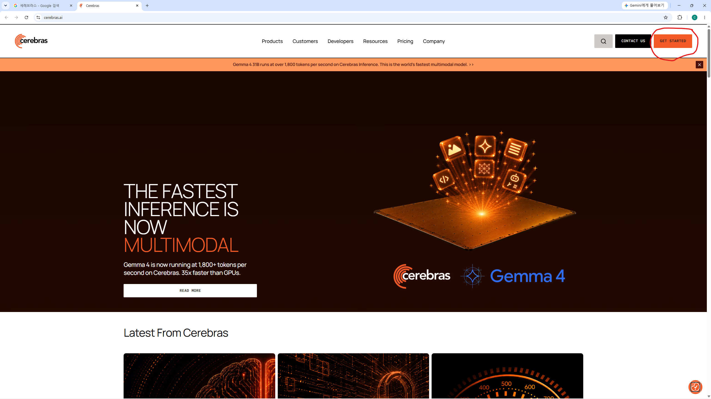
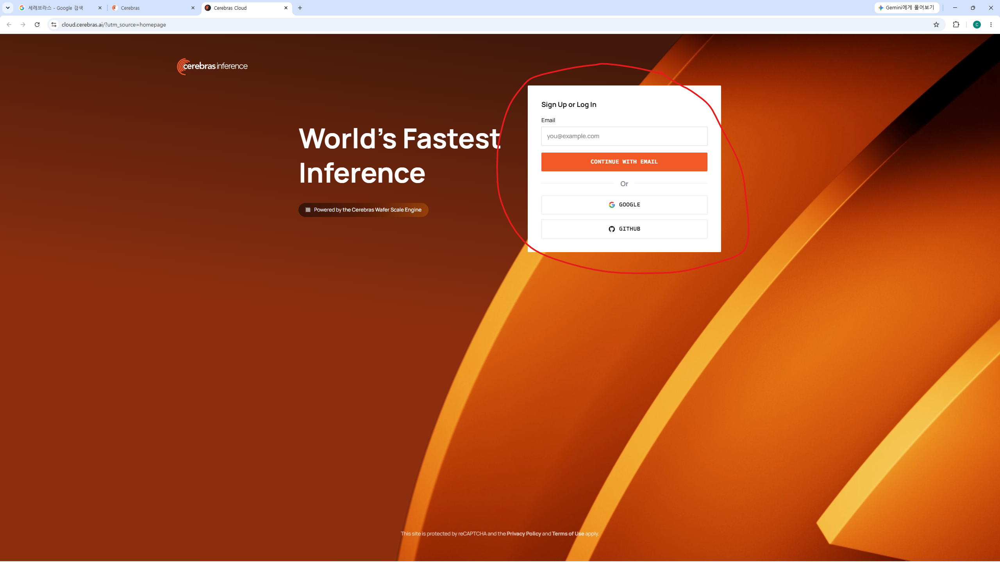
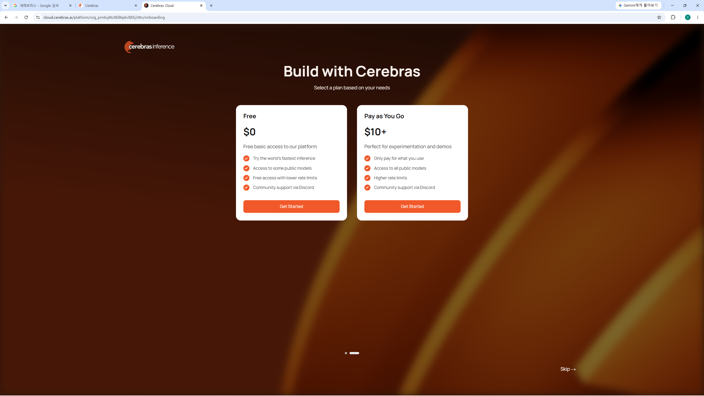
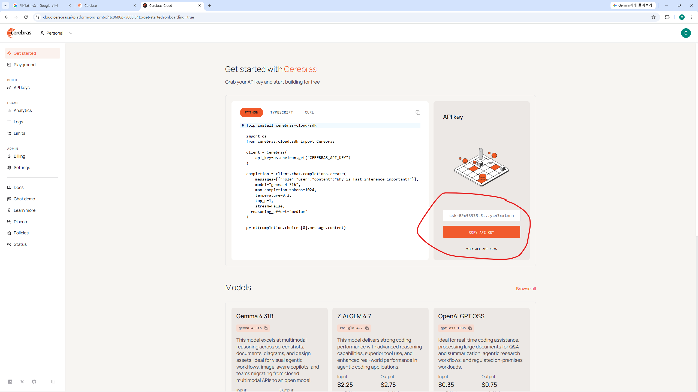
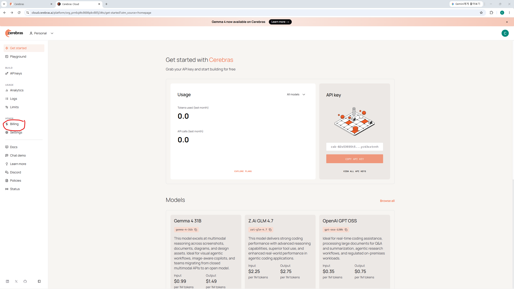
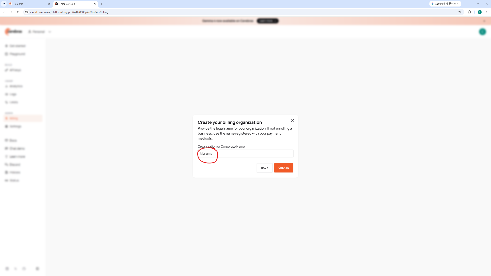
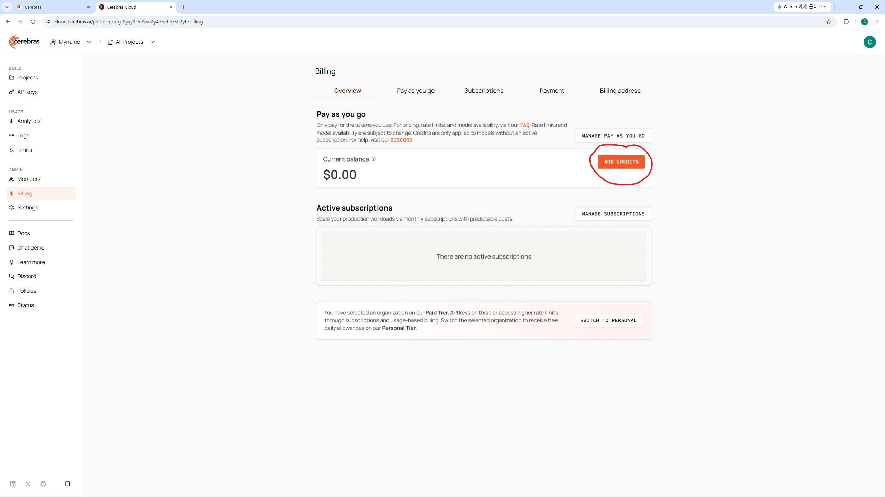

<p align="center">
  
</p>

<h1 align="center">PuriPuly <3</h1>

<p align="center">
  
  
  
  
</p>

<p align="center">Двусторонний переводчик на основе LLM для VRChat</p>

<h2 align="center">
  <a href="README.md">🇺🇸 English</a> ·
  <a href="README.ko.md">🇰🇷 한국어</a> ·
  <a href="README.ja.md">🇯🇵 日本語</a> ·
  <a href="README.zh-CN.md">🇨🇳 简体中文</a> ·
  🇷🇺 Русский
</h2>

---

## Демо


---

<video src="https://github.com/user-attachments/assets/c667f44d-b91d-42a9-b24a-e6a993b392d3" controls width="100%"></video>

Если хотите увидеть больше примеров реального общения с друзьями из других стран через PuriPuly:
- [Демо 1](https://www.youtube.com/watch?v=3p0CamYui0o)
- [Демо 2](https://youtu.be/DoX36Y7J_lc?si=YjbeVTS8v3jGQB1w)
- [Демо 3](https://www.youtube.com/watch?v=D0npvp68xNY)

---

## Наконец-то говори как настоящий друг.

Бывало же.
Хочешь поддержать друга,
а получается только: «Ты в порядке?»

Ты и сам знаешь, что «переводчик»
не способен передать то, что на сердце.

Поэтому я создал такой, который может.

- **Перевод на основе LLM** — сленг, разговорная речь, твои и ваши — всё звучит естественно.
- **Память контекста** — перевод помнит, о чём вы говорили раньше, и не теряет нить беседы.
- **Голосовой перевод в обе стороны** — переводит и вашу речь, и речь собеседника. Есть субтитры в VR.
- **Запуск через Discord** — просто установите и начните пользоваться, без сложной настройки.

## Вопросы и ответы

- **Насколько хорошее качество перевода?**
→ Если вы оба пользуетесь этим переводчиком, можно говорить на любые темы — даже самые сложные. По тестам, Gemma 4 оказался в 6 раз точнее DeepL. Подробности — в разделе «Сравнение перевода» ниже.

- **Сколько времени от фразы до перевода?**
→ С Gemma 4 и облачным распознаванием — обычно около полутора секунд.

- **Это стоит денег?**
→ Да, но не сразу. Новым пользователям даётся бесплатный кредит, а потом цены копеечные — тысячи переводов за $1.

- **Нужен ли API-ключ?**
→ Да, но не сразу. Просто установите и авторизуйтесь через Discord, чтобы начать пользоваться.

- **Как хорошо работает перевод речи собеседника?**
→ Лучше всего — один на один, в тихой комнате. С тремя людьми тоже может сработать, но без гарантий. В VRChat используйте Earmuff.

- **Распознавание работает плохо или медленно.**
→ Попробуйте переключиться с локального Qwen ASR на облачный сервис. На процессорах Intel — закрепите PuriPuly за производительными ядрами (P-cores).

- **Что происходит с голосом и текстом разговора?**
→ Всё хранится локально, на серверы PuriPuly ничего не уходит. Чужие голоса, транскрипции и переводы нигде не сохраняются. Но ваш сервис распознавания и провайдер перевода могут обрабатывать эти данные.

### [📥 Скачать](https://github.com/kapitalismho/PuriPuly-heart/releases/latest)

---

## Сравнение перевода

![Диаграмма качества перевода. Показано среднее штрафное значение ошибок на предложение (чем ниже — тем лучше), оценённое с помощью фреймворка Gemba MQM (модель-судья: Gemini 3.1 Pro Preview) на 216 многоходовых корейских образцах в парах EN, JA и ZH-Hans. Оценки: Gemini 3.1 Flash-lite 0.573, Gemini 3 Flash 0.596, Gemma 4 26B A4B 0.813, Qwen 3.5 Plus 0.958, DeepSeek V4 Flash 1.025, Gemma 4 26B A4B (без контекста) 1.265, DeepSeek V4 Flash (без контекста) 1.647, Qwen 3.5 Flash 2.198, DeepL 4.963, DeepL (без контекста) 5.717, Google Translation Basic 5.998.](docs/images/performance/1.png)

- Для эксперимента использован фреймворк Microsoft Gemba MQM.
- Тесты шли в диалоговом формате — ближе к реальному разговору.
- Полные результаты — [здесь](https://github.com/kapitalismho/korean-llm-context-translation-benchmark).

## Стоимость

### Переводов за доллар

#### Рекомендуемые модели

| LLM \ ASR | Qwen ASR (локальный) | Qwen ASR (облачный) | Soniox | Deepgram |
|---|---|---|---|---|
| **Gemma 4 26B A4B + 31B** | 14 380 | 2 920 | 3 710 | 1 180 |
| **DeepSeek V4 Flash** | 19 410 | 3 080 | 3 980 | 1 210 |

#### Другие модели

| LLM \ ASR | Qwen ASR (локальный) | Qwen ASR (облачный) | Soniox | Deepgram |
|---|---|---|---|---|
| **Gemma 4 26B A4B** | 14 380 | 2 920 | 3 710 | 1 180 |
| **Gemma 4 31B (OpenRouter)** | 13 700 | 2 780 | 3 530 | 1 120 |
| **Gemma 4 31B (Cerebras)** | 920 | 730 | 770 | 540 |
| **DeepSeek V4 Pro** | 6 400 | 2 330 | 2 810 | 1 070 |
| **Gemini 3 Flash** | 1 710 | 1 170 | 1 280 | 740 |
| **Gemini 3.1 Flash-Lite** | 3 430 | 1 770 | 2 030 | 940 |
| **Qwen 3.5 Plus** | 7 460 | 2 460 | — | — |
| **Локальные LLM** | Без ограничений | 3 660 | 5 000 | 1 290 |

### Цена одной фразы

#### Рекомендуемые модели

| LLM \ ASR | Qwen ASR (локальный) | Qwen ASR (облачный) | Soniox | Deepgram |
|---|---|---|---|---|
| **Gemma 4 26B A4B + 31B** | ~$0,00007 | ~$0,0003 | ~$0,0003 | ~$0,0008 |
| **DeepSeek V4 Flash** | ~$0,00005 | ~$0,0003 | ~$0,0003 | ~$0,0008 |

#### Другие модели

| LLM \ ASR | Qwen ASR (локальный) | Qwen ASR (облачный) | Soniox | Deepgram |
|---|---|---|---|---|
| **Gemma 4 26B A4B** | ~$0,00007 | ~$0,0003 | ~$0,0003 | ~$0,0008 |
| **Gemma 4 31B (OpenRouter)** | ~$0,00007 | ~$0,0003 | ~$0,0003 | ~$0,0009 |
| **Gemma 4 31B (Cerebras)** | ~$0,0011 | ~$0,0014 | ~$0,0013 | ~$0,0019 |
| **DeepSeek V4 Pro** | ~$0,0002 | ~$0,0004 | ~$0,0004 | ~$0,0009 |
| **Gemini 3 Flash** | ~$0,0006 | ~$0,0009 | ~$0,0008 | ~$0,0014 |
| **Gemini 3.1 Flash-Lite** | ~$0,0003 | ~$0,0006 | ~$0,0005 | ~$0,0011 |
| **Qwen 3.5 Plus** | ~$0,0001 | ~$0,0004 | — | — |
| **Локальные LLM** | $0 | ~$0,0003 | ~$0,0002 | ~$0,0008 |

*   *Расчёт: (900 входных + 12 выходных токенов) × 1,2 вызова LLM на фразу.*
*   *Переводов за доллар — по неокруглённым значениям.*
*   *Все цены приблизительны.*
*   *DeepSeek — с учётом 70% попаданий в кэш.*
*   *Qwen — по тарифам региона Пекин.*
*   *Цены на 25 мая 2026 г. / режим быстрого ответа.*

### Бесплатные кредиты

| Сервис | Бесплатный кредит | Срок | Примечание |
|--------|------------|------|------|
| **Deepgram** | $200 | Без ограничений | — |
| **Google AI Studio** | $10 | 1 год | Ежемесячно для подписчиков Gemini |
| **Alibaba Cloud** | 1 млн токенов на модель | 90 дней | Регион Сингапур |
| **Alibaba Cloud** | ¥300 | 1 год | Студенты в Китае |
| **Cerebras** | 1 млн токенов ежедневно | Без ограничений | Лимит 5 вызовов в минуту |

---

# Если у вас возникли вопросы или что-то непонятно — пишите в [Twitter/X](https://x.com/kapitalismho).

## Использование

1. Скачайте последнюю версию со [страницы загрузки](https://github.com/kapitalismho/PuriPuly-heart/releases/latest).
2. Установите PuriPuly.
3. Нажмите кнопку **STT**.
4. Нажмите кнопку **TRANS** и авторизуйтесь через Discord.
5. Нажмите кнопку **Subtitles** для включения субтитров в VR.
6. *(Необязательно)* Нажмите кнопку **Peer** для включения перевода речи собеседника.

   > Для перевода речи собеседника требуется тихое окружение. В VRChat используйте Earmuff.

7. Включите OSC в VRChat: Меню действий → Настройки → OSC → Включить.

### Если захват звука не работает

Откройте **Настройки > Основные** и выполните следующее:

1. Измените **Audio Host API** на **Auto** или **MME**.
2. Выберите правильный микрофон.
3. Перезапустите приложение.

---

### Пользователям из Китая

Если Soniox / Gemini / Deepgram у вас заблокированы, попробуйте такую связку:

- STT: **Qwen ASR**
- LLM: **DeepSeek V4 Flash**

   > Вместо Discord можно авторизоваться через QQ.

---

### Свои API-ключи

Выберите нужный сервис и следуйте инструкции.

Для перевода рекомендуем Gemma 4 через OpenRouter.

А заодно настройте и распознавание речи!
PuriPuly работает лучше всего с облачным STT.
Даже один и тот же Qwen ASR на локале и в облаке заметно отличается по качеству.

Начните с Deepgram — при регистрации дают $200.

<details>
<summary><h3>OpenRouter</h3></summary>

1. Установите параметры, обведённые красным, как на скриншоте.
   

2. В приложении нажмите кнопку, обведённую красным.
   

3. Войдите в OpenRouter.
   

4. Нажмите обведённую кнопку, чтобы выйти из экрана оплаты.
   

5. Нажмите **Authorize**.
   

6. Пополните баланс на нужную сумму.
   

<details>
<summary><h3>Если кнопка Authorize не сработала</h3></summary>

Попробуйте ещё раз или создайте API-ключ вручную:

6. Нажмите на аккаунт в правом верхнем углу → вкладка API Keys → кнопка Create.
   

7. Нажмите Create.
   

8. Скопируйте API-ключ и вставьте его на вкладку API переводчика.
   

</details>

</details>

<details>
<summary><h3>DeepSeek</h3></summary>

1. Установите параметры, обведённые красным, как на скриншоте.
   

2. Перейдите на [официальный сайт DeepSeek](https://www.deepseek.com/en/) и нажмите **Access API**.
   

3. Войдите на сайт.
   

4. Перейдите на вкладку API Keys → **Create new API Keys**.
   

5. Скопируйте API-ключ и вставьте его на вкладку API переводчика.
   

6. Перейдите на вкладку Top Up и пополните баланс.
   

</details>

<details>
<summary><h3>Deepgram</h3></summary>

1. Войдите в [Deepgram Console](https://console.deepgram.com/).
   

2. Если видите приветствие — нажмите **Skip**.
   

3. Выберите **STT (Speech-to-Text)**.
   

4. В меню API Keys нажмите **Create a New API Key**.
   

5. Введите имя ключа (например, `puripuly`) и создайте.
   

6. Скопируйте ключ и вставьте в настройки PuriPuly.
   

</details>

<details>
<summary><h3>Gemini</h3></summary>

1. Перейдите в [Google AI Studio](https://aistudio.google.com/apikey) → **Get API key**.
   

2. Создайте новый проект.
   

3. Введите любое имя.
   

4. Выберите проект → **Create key**.
   

5. Нажмите на обведённую область.
   

6. Скопируйте ключ.
   

7. *(Рекомендуется)* Нажмите жёлтую кнопку **Set Up Billing** для перехода на платный тариф.
   Переход на платный тариф может занять некоторое время.
   

<details>
<summary><h3>Для платных подписчиков Gemini</h3></summary>

8. Перейдите в [Google Developer Program](https://developers.google.com/program/my-benefits) и присоединитесь.
   

9. Выберите проект с платным тарифом из шага 7.
   

</details>

</details>

<details>
<summary><h3>Qwen</h3></summary>

1. Откройте Alibaba Cloud Model Studio:
   - [Материковый Китай](https://bailian.console.aliyun.com/cn-beijing)
   - [Остальной мир](https://bailian.console.alibabacloud.com)

2. Войдите. Убедитесь, что выбран правильный регион (например, Пекин).
   

3. Нажмите **значок шестерёнки** в правом верхнем углу.
   

4. Создайте рабочее пространство → страница **API-KEY**.
   

5. **Create API Key**.
   

6. Назначьте аккаунт и рабочее пространство → OK.
   

7. Скопируйте ключ.
   

</details>

<details>
<summary><h3>Soniox</h3></summary>

1. Войдите в [Soniox Console](https://console.soniox.com/).
   

2. Введите название организации.
   

3. Нажмите **Add Funds** для привязки оплаты.
   

4. Soniox требует предоплаты. После пополнения перейдите в **API Keys**.
   

5. Создайте новый API Key.
   

6. Скопируйте ключ и вставьте в настройки PuriPuly.
   

</details>

<details>
<summary><h3>Cerebras</h3></summary>

1. Перейдите на [Cerebras](https://www.cerebras.ai/) → **Get started**.
   

2. Войдите.
   

3. Выберите тариф. Рекомендуем начать с бесплатного.
   

4. Скопируйте API-ключ и вставьте в PuriPuly.
   

<details>
<summary><h3>Для перехода на платный тариф</h3></summary>

5. Перейдите на вкладку **Billing**.
   

6. Введите имя.
   

7. Пополните баланс.
   

</details>

</details>

---

## Архитектура

См. [`ARCHITECTURE.md`](ARCHITECTURE.md).

---

## Разработка

### Окружения

| Область | Рекомендуемое окружение | Документация |
|---|---|---|
| Python-приложение для рабочего стола | Windows | Этот раздел |
| Сервис-брокер | Linux | [`broker/README.md`](broker/README.md) |
| Нативный VR-оверлей | Windows | [`native/overlay/README.md`](native/overlay/README.md) |

### Python-окружение

Python-приложению требуется Python 3.12 или 3.13.

Создайте и активируйте окружение Windows:

```powershell
python -m venv .venv
.venv\Scripts\Activate.ps1
```

Установите приложение и зависимости для разработки:

```powershell
python -m pip install --upgrade pip
pip install -e ".[dev]"
```

Вместо этого можно использовать `uv`:

```powershell
uv sync --dev
```

Установите хуки репозитория:

```powershell
pre-commit install
```

Для работы в Linux или WSL используйте `.venv-wsl`, если он доступен.

```bash
UV_PROJECT_ENVIRONMENT=.venv-wsl uv sync --dev
```

В репозиториях с настроенным `direnv` команды можно запускать так:

```bash
direnv exec . <command>
```

### Запуск приложения

Запустите Flet-приложение для рабочего стола:

```powershell
python -m puripuly_heart.main run-gui
```

Эквивалентная команда с `uv`:

```powershell
uv run python -m puripuly_heart.main run-gui
```

Элементы предпросмотра для разработчика (скрытые состояния интерфейса) включаются так:

```powershell
python -m puripuly_heart.main run-gui --debug-ui-preview
```

### Проверка Python-кода

Отформатируйте исходники и тесты Python:

```powershell
black src tests
```

Проверка форматирования без изменения файлов:

```powershell
black --check src tests
```

Запуск проверок линтером:

```powershell
ruff check src tests
```

Запуск полного набора тестов Python:

```powershell
python -m pytest
```

Запуск конкретного файла или каталога тестов во время разработки:

```powershell
python -m pytest tests/path/to/test_file.py
```

### Прочие области

Документация брокера ведётся в [`broker/README.md`](broker/README.md).

Документация нативного VR-оверлея ведётся в [`native/overlay/README.md`](native/overlay/README.md).

---

## Разработчик

[salee](https://github.com/kapitalismho)

---

## Участники

[RICHARDwuxiaofei](https://github.com/RICHARDwuxiaofei)
[fzcfweasdferttgg-png](https://github.com/fzcfweasdferttgg-png)

---

## Особая благодарность

SUI\_32C, Nagikokoro, motoka96, \_Ykol魚, kascr\_, Just Monika V, FLUVIA, Han โชเล่ย์, EA\_PE, Ephedrine, ~ eri ~, fzcfweasdferttgg-png, nunu299

---

## Лицензия

[AGPL-3.0-or-later](LICENSE)

Сторонние лицензии и уведомления: `src/puripuly_heart/data/THIRD_PARTY_NOTICES.txt`
