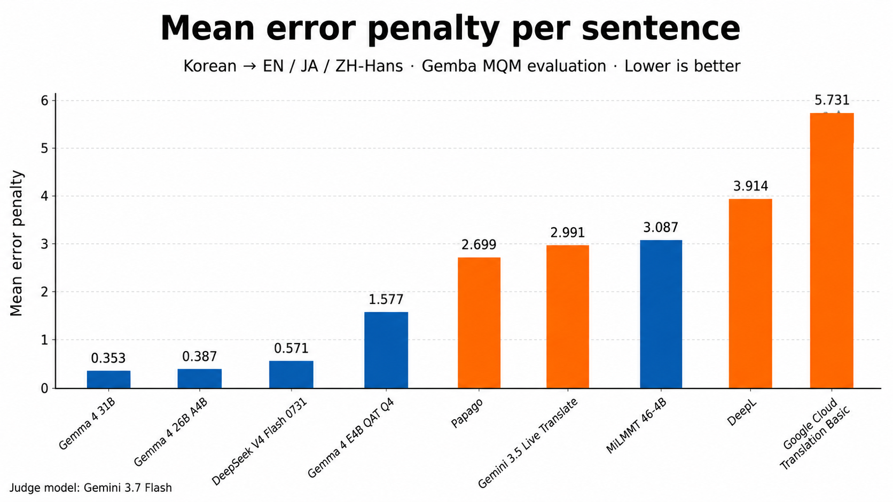

<p align="center">
  
</p>

<h1 align="center">PuriPuly <3</h1>

<p align="center">
  
  
  
  
</p>

<p align="center">Obojsmerný prekladač pre VRChat poháňaný LLM</p>

<h2 align="center">
  <a href="README.md">🇺🇸 English</a> ·
  <a href="README.ar.md">🇸🇦 العربية</a> ·
  <a href="README.bg.md">🇧🇬 Български</a> ·
  <a href="README.ca.md">CA Català</a> ·
  <a href="README.cs.md">🇨🇿 Čeština</a> ·
  <a href="README.da.md">🇩🇰 Dansk</a> ·
  <a href="README.de.md">🇩🇪 Deutsch</a> ·
  <a href="README.el.md">🇬🇷 Ελληνικά</a> ·
  <a href="README.es.md">🇪🇸 Español</a> ·
  <a href="README.et.md">🇪🇪 Eesti</a> ·
  <a href="README.fi.md">🇫🇮 Suomi</a> ·
  <a href="README.fr.md">🇫🇷 Français</a> ·
  <a href="README.hi.md">🇮🇳 हिन्दी</a> ·
  <a href="README.hu.md">🇭🇺 Magyar</a> ·
  <a href="README.id.md">🇮🇩 Bahasa Indonesia</a> ·
  <a href="README.it.md">🇮🇹 Italiano</a> ·
  <a href="README.ja.md">🇯🇵 日本語</a> ·
  <a href="README.ko.md">🇰🇷 한국어</a> ·
  <a href="README.lt.md">🇱🇹 Lietuvių</a> ·
  <a href="README.lv.md">🇱🇻 Latviešu</a> ·
  <a href="README.ms.md">🇲🇾 Bahasa Melayu</a> ·
  <a href="README.nl.md">🇳🇱 Nederlands</a> ·
  <a href="README.no.md">🇳🇴 Norsk</a> ·
  <a href="README.pl.md">🇵🇱 Polski</a> ·
  <a href="README.pt.md">🇵🇹 Português</a> ·
  <a href="README.ro.md">🇷🇴 Română</a> ·
  <a href="README.ru.md">🇷🇺 Русский</a> ·
  🇸🇰 Slovenčina ·
  <a href="README.sv.md">🇸🇪 Svenska</a> ·
  <a href="README.th.md">🇹🇭 ไทย</a> ·
  <a href="README.tr.md">🇹🇷 Türkçe</a> ·
  <a href="README.uk.md">🇺🇦 Українська</a> ·
  <a href="README.vi.md">🇻🇳 Tiếng Việt</a> ·
  <a href="README.zh-CN.md">🇨🇳 简体中文</a> ·
  <a href="README.zh-TW.md">🇹🇼 繁體中文</a>
</h2>

> ⚠️ **Toto je prenosný fork** [kapitalismho/PuriPuly-heart](https://github.com/kapitalismho/PuriPuly-heart). Upravený pre jednoduchú distribúciu a úpravy. [Stiahnuť prenosnú verziu ←](../../releases)

---

## Demo


---

<video src="https://github.com/user-attachments/assets/c667f44d-b91d-42a9-b24a-e6a993b392d3" controls width="100%"></video>

Viac príkladov reálnej komunikácie cez PuriPuly:
- [Demo 1](https://www.youtube.com/watch?v=3p0CamYui0o)
- [Demo 2](https://youtu.be/DoX36Y7J_lc?si=YjbeVTS8v3jGQB1w)
- [Demo 3](https://www.youtube.com/watch?v=D0npvp68xNY)

---

## Konečne, hovorte ako skutoční priatelia.

Boli ste v tej situácii.
Chceli ste potešiť priateľa,
ale podarilo sa vám len: "Si v poriadku?"

Už viete, že "prekladač" nedokáže preniesť to, čo máte v srdci.
Preto som vytvoril taký, ktorý to dokáže.

- **Preklad s LLM** — slang, hovorové výrazy, formálna a neformálna reč — všetko prenesené prirodzene.
- **Pamäť kontextu** — konverzácia plynulo plynie s ohľadom na predchádzajúci kontext.
- **Obojsmerný hlasový preklad** — prekladá aj hlas druhej osoby, s podporou VR titulkov.
- **Spustenie cez Discord** — začnite okamžite bez zložitého nastavenia.

## Často kladené otázky

- **Aká je kvalita prekladu?**
→ S Gemma 4 je výsledok 6x lepší ako DeepL.

- **Ako dlho to trvá?**
→ S Gemma 4 a cloudovým STT je oneskorenie približne sekundu a pol.

- **Stojí to peniaze?**
→ Áno, ale nie hneď. Noví používatelia získajú bezplatný kredit. Potom sú ceny veľmi nízke — tisíce viet za 1$.

- **Potrebujem API kľúč?**
→ Áno, ale nie hneď. Stačí nainštalovať a overiť cez Discord.

- **Ako funguje preklad hlasu druhej osoby?**
→ Najlepšie funguje v rozhovoroch jeden na jedného v tichom prostredí. Vo VRChat použite Earmuff.

- **Rozpoznávanie reči je slabé/pomalé.**
→ Použite cloudové STT. Na Intel procesoroch používajte iba výkonné jadrá.

- **Ako sa zaobchádza s údajmi?**
→ Hlas a obsah konverzácie sa ukladajú lokálne a neodosielajú sa na servery.

### [📥 Stiahnuť](https://github.com/kapitalismho/PuriPuly-heart/releases/latest)

---

## Porovnanie prekladu


- Experiment s Microsoft Gemba MQM.
- Viackolové prostredie pre realistickejší rozhovor.
- Plné výsledky [tu](https://github.com/kapitalismho/korean-llm-context-translation-benchmark).

## Cena

### Použitia za dolár

| LLM \ ASR | Qwen ASR (lokálny) | Qwen ASR (cloud) | Soniox | Deepgram |
|---|---|---|---|---|
| **Gemma 4 26B A4B** | 14,380 | 2,920 | 3,710 | 1,180 |
| **DeepSeek V4 Flash** | 19,410 | 3,080 | 3,980 | 1,210 |

### Bezplatné kredity

| Služba | Bezplatný kredit | Trvanie | Poznámka |
|--------|------------|------|------|
| **Deepgram** | $200 | Bez obmedzenia | - |
| **Google AI Studio** | $10 | 1 rok | Mesačne pre predplatiteľov Gemini |
| **Alibaba Cloud** | 1M tokenov na model | 90 dní | Región Singapur |
| **Cerebras** | 1M tokenov denne | Bez obmedzenia | Limit 5 hovorov/min |

---

## Použitie

1. Stiahnite si najnovšiu verziu zo [stránky na stiahnutie](https://github.com/kapitalismho/PuriPuly-heart/releases/latest).
2. Nainštalujte PuriPuly.
3. Stlačte **STT**.
4. Stlačte **TRANS** a overte cez Discord.
5. Stlačte **Subtitles** pre VR titulky.
6. Stlačte **Peer** pre preklad hlasu druhej osoby.
7. Povoľte OSC vo VRChat: Menu ← Nastavenia ← OSC ← Povoliť.

---

## Vývoj

```bash
python -m venv .venv
.venv\Scripts\activate
pip install -e '.[dev]'
python -m puripuly_heart.main run-gui
```

```bash
black src tests
ruff check src tests
python -m pytest
```

---

## Vývojár
[salee](https://github.com/kapitalismho)

## Licencia
[AGPL-3.0-or-later](LICENSE)
